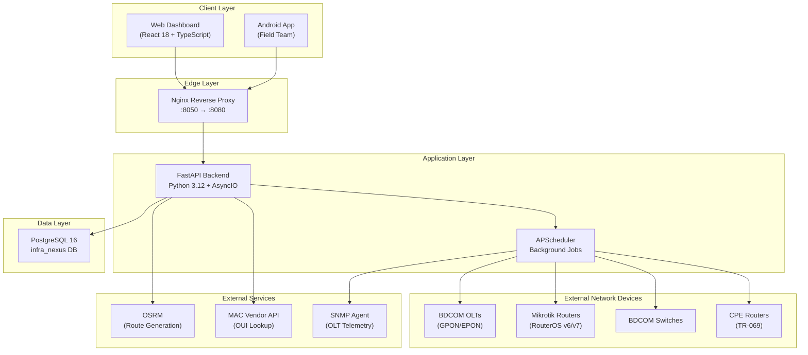
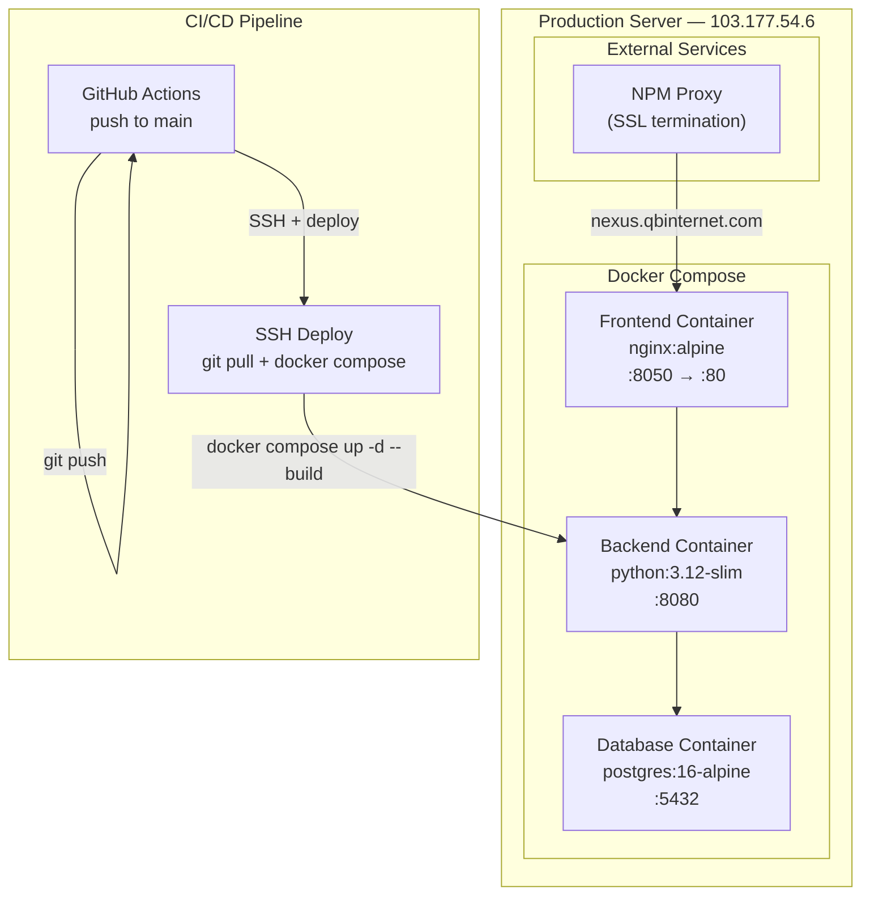
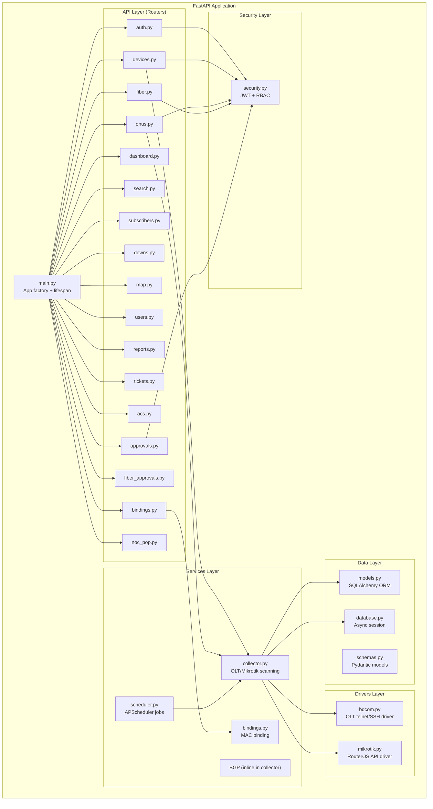
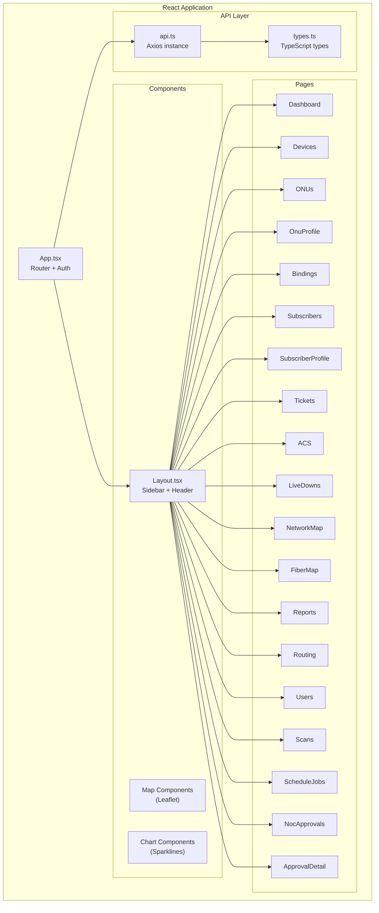
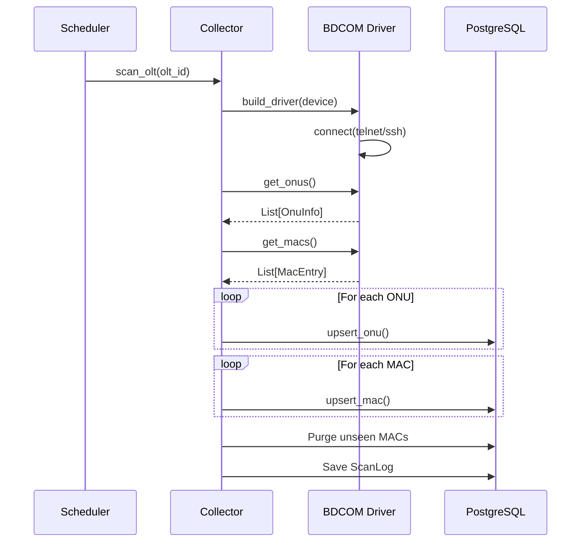
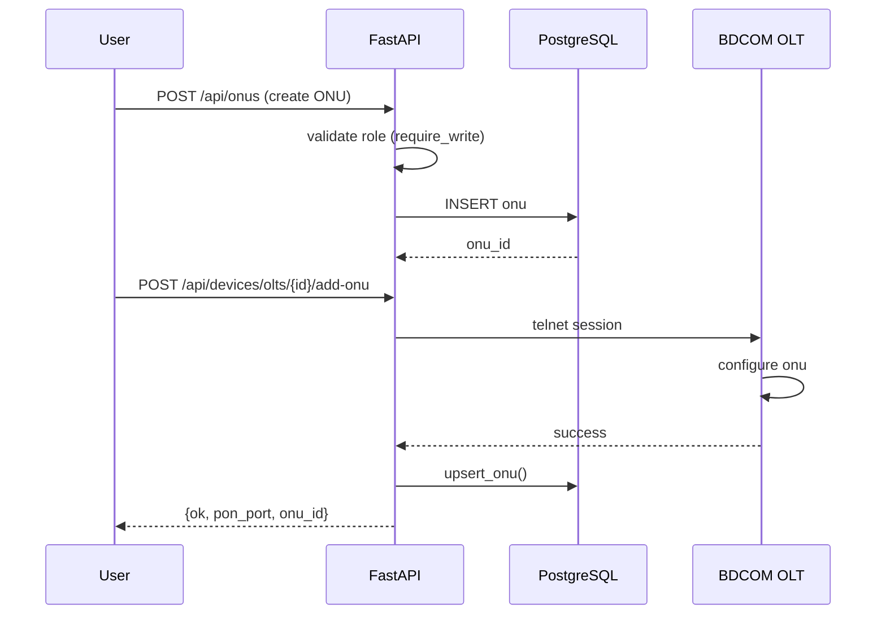
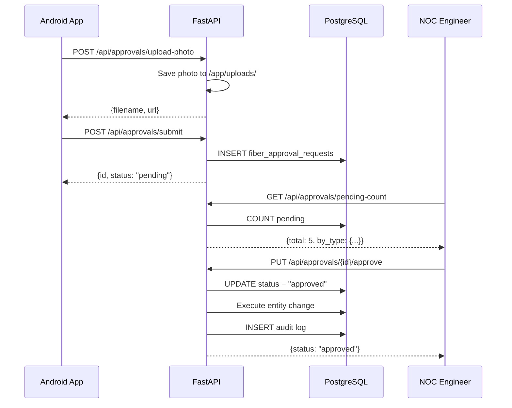
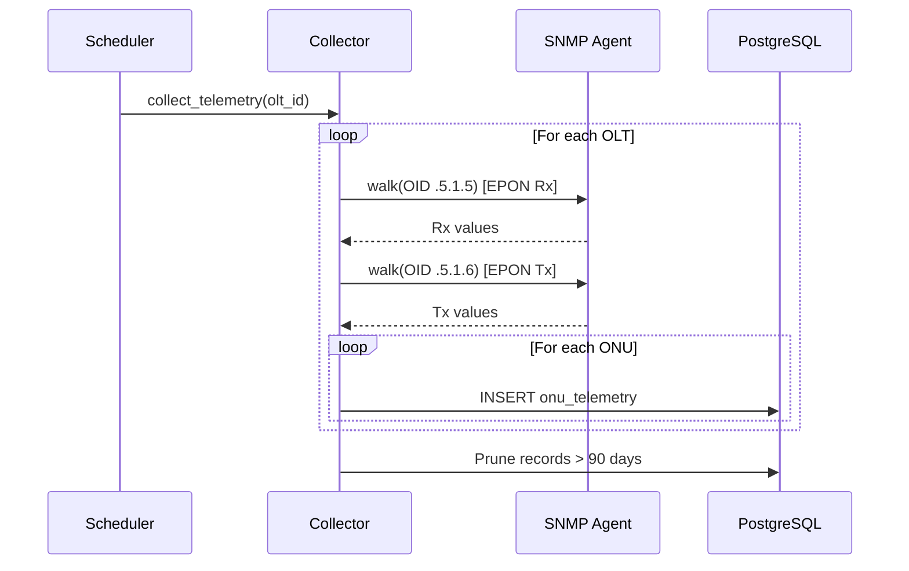
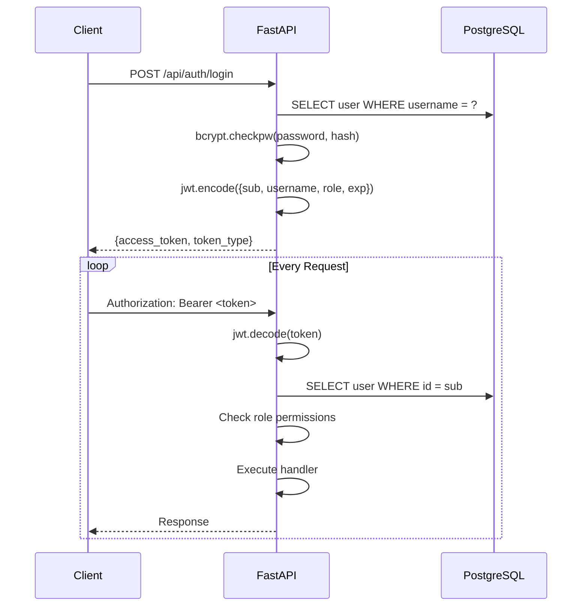

# System Architecture

## Infra NEXUS — Architecture Overview

**Version:** 1.0  
**Last Updated:** 2026-08-31

---

## 1. High-Level Architecture



---

## 2. Deployment Architecture



### Container Details

| Container | Base Image | Port | Volume | Network |
|-----------|-----------|------|--------|---------|
| `infra-nexus-frontend` | `nginx:alpine` | 8050→80 | Static build | `nexus_internal` |
| `infra-nexus-backend` | `python:3.12-slim` | 8080 | `/app/uploads/approval-photos` | `nexus_internal`, `proxy_npm_network` |
| `infra-nexus-db` | `postgres:16-alpine` | 5432 (internal) | `nexus_pgdata` | `nexus_internal` |

### Network Topology

- `nexus_internal` — Internal bridge network for container-to-container communication
- `proxy_npm_network` — External network connecting to Nginx Proxy Manager for SSL termination

---

## 3. Backend Architecture



### Key Design Patterns

#### 3.1 Dependency Injection (FastAPI)
```python
# Every route handler receives its dependencies via FastAPI's DI system
async def get_current_user(
    token: str = Depends(oauth2_scheme),
    db: AsyncSession = Depends(get_db),
) -> User:
    ...
```

#### 3.2 Role-Based Access Control (RBAC)
```
admin > global_write > noc > field_team > global_read
```
Each endpoint has a permission guard function:
- `get_current_user` — any authenticated user
- `require_write` — admin, global_write
- `require_ops` — admin, global_write, noc
- `require_gps_write` — admin, global_write, field_team
- `require_admin` — admin only
- `require_fiber_request` — admin, global_write, field_team
- `require_noc_approval` — admin, global_write, noc
- `require_approval_submit` — admin, global_write, field_team

#### 3.3 Upsert Pattern
```python
# Used throughout collector.py for idempotent data collection
result = await session.execute(select(Model).where(Model.field == value))
existing = result.scalar_one_or_none()
if existing:
    existing.field = new_value
else:
    session.add(Model(field=new_value))
```

#### 3.4 Scheduled Job Pattern
```python
# APScheduler with async job functions
scheduler.add_job(
    _scan_all_olts,
    "interval",
    seconds=settings.scan_olt_interval,
    id="scan_olts",
    max_instances=1,
    coalesce=True,
)
```

---

## 4. Frontend Architecture



### Frontend Routes

| Path | Component | Auth | Description |
|------|-----------|------|-------------|
| `/login` | Login | No | Authentication page |
| `/` | Dashboard | Yes | Main dashboard |
| `/devices` | Devices | Yes | OLT/Mikrotik/Switch management |
| `/onus` | Onus | Yes | ONU inventory list |
| `/onus/:id` | OnuProfile | Yes | Individual subscriber profile |
| `/bindings` | Bindings | Yes | MAC binding resolution |
| `/subscribers` | Subscribers | Yes | Subscriber list |
| `/subscribers/:subscriber` | SubscriberProfile | Yes | Subscriber detail |
| `/tickets` | Tickets | Yes | Support tickets |
| `/acs` | Acs | Yes | TR-069 device management |
| `/live-downs` | LiveDowns | Yes | Real-time down detection |
| `/network-map` | NetworkMap | Yes | Subscriber map |
| `/fiber-map` | FiberMap | Yes | Fiber infrastructure map |
| `/reports` | Reports | Yes | Reports and exports |
| `/routing` | Routing | Yes | BGP monitoring |
| `/users` | Users | Yes | User management (admin) |
| `/scans` | Scans | Yes | Scan log history |
| `/schedule-jobs` | ScheduleJobs | Yes | Scheduled job status |
| `/approvals` | NocApprovals | Yes | NOC approval queue |
| `/approvals/:id` | ApprovalDetail | Yes | Approval review page |

### Tech Stack

| Layer | Technology | Version |
|-------|-----------|---------|
| Build | Vite | 5.4.11 |
| UI Framework | React | 18.3.1 |
| Language | TypeScript | 5.6.3 |
| Routing | React Router | 6.28.0 |
| Styling | Tailwind CSS | 3.4.17 |
| Maps | Leaflet + leaflet-draw | 1.9.4 / 1.0.4 |
| HTTP Client | Axios | (via api.ts) |

---

## 5. Data Flow Diagrams

### 5.1 OLT Scan Flow



### 5.2 Subscriber Provisioning Flow



### 5.3 Field Submission → NOC Approval Flow



### 5.4 Telemetry Collection Flow



---

## 6. Security Architecture

### 6.1 Authentication Flow



### 6.2 Permission Matrix

| Endpoint Category | admin | global_write | noc | field_team | global_read |
|------------------|-------|-------------|-----|------------|-------------|
| User management | ✅ | ❌ | ❌ | ❌ | ❌ |
| Device CRUD | ✅ | ✅ | ❌ | ❌ | ❌ |
| Scan/Test/Down | ✅ | ✅ | ✅ | ❌ | ❌ |
| GPS/Address update | ✅ | ✅ | ❌ | ✅ | ❌ |
| Fiber infrastructure | ✅ | ✅ | ❌ | ❌ | ❌ |
| Submit for approval | ✅ | ✅ | ❌ | ✅ | ❌ |
| Review approvals | ✅ | ✅ | ✅ | ❌ | ❌ |
| Read-only access | ✅ | ✅ | ✅ | ✅ | ✅ |

---

## 7. File Structure

```
olt-commander/
├── backend/
│   ├── app/
│   │   ├── api/                    # FastAPI routers
│   │   │   ├── acs.py             # TR-069 ACS management
│   │   │   ├── approvals.py       # Centralized NOC approval queue
│   │   │   ├── auth.py            # Authentication + JWT
│   │   │   ├── bindings.py        # MAC binding resolution
│   │   │   ├── dashboard.py       # Dashboard summary
│   │   │   ├── devices.py         # OLT/Mikrotik/Switch CRUD
│   │   │   ├── downs.py           # Live down detection
│   │   │   ├── fiber.py           # Fiber infrastructure CRUD
│   │   │   ├── fiber_approvals.py # Fiber approval workflow (legacy)
│   │   │   ├── map.py             # Network map data
│   │   │   ├── noc_pop.py         # NOC/POP management
│   │   │   ├── onus.py            # ONU management
│   │   │   ├── reports.py         # Reports + export
│   │   │   ├── search.py          # Global search
│   │   │   ├── subscribers.py     # Subscriber profiles
│   │   │   ├── tickets.py         # Support tickets
│   │   │   └── users.py           # User management
│   │   ├── drivers/               # Device communication drivers
│   │   │   ├── bdcom.py           # BDCOM OLT telnet/SSH
│   │   │   └── mikrotik.py        # Mikrotik RouterOS API
│   │   ├── services/              # Business logic
│   │   │   ├── collector.py       # OLT/Mikrotik scanning + telemetry
│   │   │   └── scheduler.py       # APScheduler background jobs
│   │   ├── utils/                 # Utility functions
│   │   │   └── time.py            # UTC time helpers
│   │   ├── models.py              # SQLAlchemy ORM models
│   │   ├── schemas.py             # Pydantic request/response schemas
│   │   ├── security.py            # JWT + RBAC + password hashing
│   │   ├── database.py            # Async SQLAlchemy setup
│   │   ├── config.py              # Pydantic Settings (env vars)
│   │   └── main.py                # FastAPI app factory
│   ├── migrations/
│   │   └── 002_extend_approvals.sql
│   ├── uploads/
│   │   └── approval-photos/       # Photo storage
│   ├── Dockerfile
│   └── requirements.txt
├── frontend/
│   ├── src/
│   │   ├── api/
│   │   │   ├── api.ts             # Axios instance
│   │   │   └── types.ts           # TypeScript interfaces
│   │   ├── components/            # Shared components
│   │   │   └── Layout.tsx         # Sidebar + header
│   │   ├── pages/                 # Page components
│   │   │   ├── Dashboard.tsx
│   │   │   ├── Devices.tsx
│   │   │   ├── Onus.tsx
│   │   │   ├── OnuProfile.tsx
│   │   │   ├── Bindings.tsx
│   │   │   ├── Subscribers.tsx
│   │   │   ├── SubscriberProfile.tsx
│   │   │   ├── Tickets.tsx
│   │   │   ├── Acs.tsx
│   │   │   ├── LiveDowns.tsx
│   │   │   ├── NetworkMap.tsx
│   │   │   ├── FiberMap.tsx
│   │   │   ├── Reports.tsx
│   │   │   ├── Routing.tsx
│   │   │   ├── Users.tsx
│   │   │   ├── Scans.tsx
│   │   │   ├── ScheduleJobs.tsx
│   │   │   ├── NocApprovals.tsx
│   │   │   └── ApprovalDetail.tsx
│   │   ├── App.tsx                # Root component + routes
│   │   └── main.tsx               # Entry point
│   ├── Dockerfile
│   ├── package.json
│   └── tailwind.config.js
├── docker-compose.yml
├── .github/workflows/deploy.yml
└── docs/                          # This documentation
```

---

## 8. External Dependencies

### 8.1 Python Dependencies (backend)

| Package | Purpose |
|---------|---------|
| fastapi | Web framework |
| uvicorn | ASGI server |
| sqlalchemy[asyncio] | ORM |
| asyncpg | PostgreSQL async driver |
| pydantic-settings | Configuration |
| python-jose | JWT tokens |
| bcrypt | Password hashing |
| httpx | Async HTTP client |
| apscheduler | Background jobs |
| pysnmp | SNMP client |
| openpyxl | XLSX export |
| reportlab | PDF generation |
| telnetlib3 | Async telnet (OLT) |
| routeros-api | Mikrotik API |

### 8.2 External Services

| Service | URL | Purpose |
|---------|-----|---------|
| OSRM | `router.project-osrm.org` | Route generation for cables |
| MAC Vendor API | `api.macvendors.com` | OUI lookup |

---

## 9. Scalability Considerations

| Dimension | Current | Limit | Mitigation |
|-----------|---------|-------|------------|
| OLTs | ~10-50 | 200+ | Parallel scanning, configurable intervals |
| ONUs | ~1000-5000 | 50,000+ | Batch upserts, connection pooling |
| Telemetry | 90-day retention | ~10M rows | Pruning job, partitioning |
| Concurrent users | ~5-20 | 100+ | Async backend, connection pooling |
| File uploads | Photos | 10MB/file | Local storage, Docker volume |

### Connection Pool Configuration

```python
engine = create_async_engine(
    settings.database_url,
    pool_pre_ping=True,
    echo=False,
    pool_size=10,      # base connections
    max_overflow=20,   # burst connections
)
```
