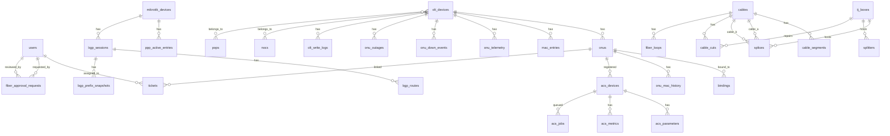

# Database Schema

## Infra NEXUS — PostgreSQL Database Reference

**Database:** `infra_nexus`  
**Engine:** PostgreSQL 16 (async via SQLAlchemy + asyncpg)  
**ORM:** SQLAlchemy 2.0 (mapped_column style)  
**Schema Management:** `Base.metadata.create_all()` (no Alembic)

---

## 1. Schema Overview



---

## 2. Table Definitions

### 2.1 `users`

| Column | Type | Constraints | Description |
|--------|------|-------------|-------------|
| `id` | INTEGER | PK, auto-increment | User ID |
| `username` | VARCHAR(64) | UNIQUE, indexed | Login username |
| `password_hash` | VARCHAR(256) | NOT NULL | bcrypt hash |
| `role` | ENUM | DEFAULT 'admin' | admin/global_write/global_read/noc/field_team |
| `is_admin` | BOOLEAN | DEFAULT true | Legacy admin flag |
| `created_at` | TIMESTAMPTZ | SERVER DEFAULT now() | Creation timestamp |

### 2.2 `olt_devices`

| Column | Type | Constraints | Description |
|--------|------|-------------|-------------|
| `id` | INTEGER | PK, auto-increment | OLT ID |
| `name` | VARCHAR(128) | indexed | Device name |
| `ip` | VARCHAR(64) | NOT NULL | Management IP |
| `vendor` | VARCHAR(32) | DEFAULT 'bdcom' | Manufacturer |
| `pon_type` | VARCHAR(8) | DEFAULT 'gpon' | gpon or epon |
| `access_method` | ENUM | DEFAULT 'telnet' | telnet/ssh/both |
| `port` | INTEGER | DEFAULT 23 | Telnet/SSH port |
| `username` | VARCHAR(128) | DEFAULT '' | Login username |
| `password` | VARCHAR(256) | DEFAULT '' | Login password |
| `enable_password` | VARCHAR(256) | DEFAULT '' | Enable password |
| `snmp_community` | VARCHAR(64) | DEFAULT 'public' | SNMP community string |
| `snmp_version` | VARCHAR(8) | DEFAULT '2c' | SNMP version |
| `snmp_port` | INTEGER | DEFAULT 161 | SNMP port |
| `snmp_enabled` | BOOLEAN | DEFAULT false | SNMP polling enabled |
| `port_capacity` | INTEGER | DEFAULT 32 | Max ONUs per PON port |
| `port_descriptions` | TEXT | DEFAULT '{}' | JSON: port→description map |
| `enabled` | BOOLEAN | DEFAULT true | Scan enabled |
| `status` | VARCHAR(32) | DEFAULT 'unknown' | reachable/unreachable/unknown |
| `noc_id` | INTEGER | FK → nocs.id, nullable | Assigned NOC |
| `pop_id` | INTEGER | FK → pops.id, nullable | Assigned POP |
| `last_scan_at` | TIMESTAMPTZ | nullable | Last scan timestamp |
| `last_message` | TEXT | DEFAULT '' | Last scan result message |
| `created_at` | TIMESTAMPTZ | SERVER DEFAULT now() | Creation timestamp |

**Relationships:** `onus` (one-to-many), `write_logs` (one-to-many)

### 2.3 `mikrotik_devices`

| Column | Type | Constraints | Description |
|--------|------|-------------|-------------|
| `id` | INTEGER | PK, auto-increment | Mikrotik ID |
| `name` | VARCHAR(128) | indexed | Device name |
| `ip` | VARCHAR(64) | NOT NULL | Management IP |
| `api_port` | INTEGER | DEFAULT 8728 | RouterOS API port |
| `use_ssl` | BOOLEAN | DEFAULT false | Enable SSL |
| `routeros_version` | INTEGER | DEFAULT 6 | 6 or 7 |
| `username` | VARCHAR(128) | DEFAULT '' | Login username |
| `password` | VARCHAR(256) | DEFAULT '' | Login password |
| `enabled` | BOOLEAN | DEFAULT true | Scan enabled |
| `status` | VARCHAR(32) | DEFAULT 'unknown' | reachable/unreachable/unknown |
| `last_scan_at` | TIMESTAMPTZ | nullable | Last scan timestamp |
| `last_message` | TEXT | DEFAULT '' | Last scan result message |
| `subscriber_count` | INTEGER | DEFAULT 0 | PPP secrets total |
| `active_count` | INTEGER | DEFAULT 0 | Active PPP sessions |
| `created_at` | TIMESTAMPTZ | SERVER DEFAULT now() | Creation timestamp |

**Relationships:** `bgp_sessions` (one-to-many)

### 2.4 `switch_devices`

| Column | Type | Constraints | Description |
|--------|------|-------------|-------------|
| `id` | INTEGER | PK, auto-increment | Switch ID |
| `name` | VARCHAR(128) | indexed | Device name |
| `ip` | VARCHAR(64) | NOT NULL | Management IP |
| `vendor` | VARCHAR(32) | DEFAULT 'bdcom' | Manufacturer |
| `port_count` | INTEGER | DEFAULT 24 | Physical port count |
| `access_method` | VARCHAR(16) | DEFAULT 'telnet' | telnet/ssh |
| `port` | INTEGER | DEFAULT 23 | Management port |
| `username` | VARCHAR(128) | DEFAULT '' | Login username |
| `password` | VARCHAR(256) | DEFAULT '' | Login password |
| `enable_password` | VARCHAR(256) | DEFAULT '' | Enable password |
| `snmp_enabled` | BOOLEAN | DEFAULT false | SNMP enabled |
| `snmp_community` | VARCHAR(64) | DEFAULT 'public' | SNMP community |
| `snmp_version` | VARCHAR(8) | DEFAULT '2c' | SNMP version |
| `snmp_port` | INTEGER | DEFAULT 161 | SNMP port |
| `enabled` | BOOLEAN | DEFAULT true | Scan enabled |
| `status` | VARCHAR(32) | DEFAULT 'unknown' | Status |
| `noc_id` | INTEGER | FK → nocs.id, nullable | Assigned NOC |
| `pop_id` | INTEGER | FK → pops.id, nullable | Assigned POP |
| `last_scan_at` | TIMESTAMPTZ | nullable | Last scan timestamp |
| `last_message` | TEXT | DEFAULT '' | Last scan message |
| `created_at` | TIMESTAMPTZ | SERVER DEFAULT now() | Creation timestamp |

### 2.5 `switch_ports`

| Column | Type | Constraints | Description |
|--------|------|-------------|-------------|
| `id` | INTEGER | PK, auto-increment | Port ID |
| `switch_id` | INTEGER | FK → switch_devices.id, CASCADE, indexed | Parent switch |
| `name` | VARCHAR(64) | NOT NULL | Port name (e.g., Gi0/1) |
| `status` | VARCHAR(32) | DEFAULT 'unknown' | up/down/disabled |
| `speed` | VARCHAR(32) | DEFAULT '' | 10M/100M/1G |
| `vlan` | VARCHAR(32) | DEFAULT '' | VLAN assignment |
| `mac_address` | VARCHAR(32) | DEFAULT '' | Connected MAC |
| `description` | VARCHAR(256) | DEFAULT '' | Port description |
| `rx_bytes` | INTEGER | DEFAULT 0 | Receive bytes counter |
| `tx_bytes` | INTEGER | DEFAULT 0 | Transmit bytes counter |
| `last_scan_at` | TIMESTAMPTZ | nullable | Last scan timestamp |

### 2.6 `onus`

| Column | Type | Constraints | Description |
|--------|------|-------------|-------------|
| `id` | INTEGER | PK, auto-increment | ONU ID |
| `olt_id` | INTEGER | FK → olt_devices.id, CASCADE, indexed | Parent OLT |
| `source` | ENUM | DEFAULT 'manual' | manual/auto |
| `state` | ENUM | DEFAULT 'unknown' | active/inactive/offline/unknown |
| `name` | VARCHAR(256) | DEFAULT '' | ONU name (from OLT description) |
| `serial` | VARCHAR(64) | DEFAULT '', indexed | ONU serial number |
| `mac` | VARCHAR(32) | DEFAULT '' | ONU MAC address |
| `pon_port` | VARCHAR(32) | DEFAULT '', indexed | PON port (e.g., GPON0/1:5) |
| `onu_id` | INTEGER | DEFAULT 0 | ONU ID on PON port |
| `vlan` | INTEGER | DEFAULT 0 | VLAN assignment |
| `rx_power` | FLOAT | nullable | Optical RX power (dBm) |
| `tx_power` | FLOAT | nullable | Optical TX power (dBm) |
| `distance` | FLOAT | nullable | Distance in km |
| `last_mac` | VARCHAR(32) | DEFAULT '' | Last seen MAC |
| `mikrotik_ip` | VARCHAR(64) | DEFAULT '' | Associated Mikrotik IP |
| `subscriber` | VARCHAR(128) | DEFAULT '' | PPPoE username |
| `bound` | BOOLEAN | DEFAULT false | MAC binding resolved |
| `down_reason` | VARCHAR(64) | DEFAULT '' | power-off/wire-down/etc. |
| `bandwidth_mode` | VARCHAR(16) | DEFAULT '100m' | 100m/1g |
| `note` | TEXT | DEFAULT '' | Operator notes |
| `last_seen` | TIMESTAMPTZ | nullable | Last seen timestamp |
| `created_at` | TIMESTAMPTZ | SERVER DEFAULT now() | Creation timestamp |
| `updated_at` | TIMESTAMPTZ | SERVER DEFAULT now() | Last update timestamp |
| `address` | TEXT | DEFAULT '' | Subscriber address |
| `gps_lat` | FLOAT | nullable | GPS latitude |
| `gps_lng` | FLOAT | nullable | GPS longitude |
| `gps_accuracy` | FLOAT | nullable | GPS accuracy (meters, must be < 9) |
| `phone` | VARCHAR(64) | DEFAULT '' | Primary phone |
| `mobile2` | VARCHAR(64) | DEFAULT '' | Secondary phone |
| `email` | VARCHAR(128) | DEFAULT '' | Email address |
| `govt_id_type` | VARCHAR(16) | DEFAULT '' | NID/DL/PP |
| `govt_id_number` | VARCHAR(64) | DEFAULT '' | Government ID number |
| `dob` | VARCHAR(16) | DEFAULT '' | Date of birth (YYYY-MM-DD) |
| `landmark` | VARCHAR(256) | DEFAULT '' | Nearby landmark |

**Constraints:**
- `UNIQUE(olt_id, pon_port, onu_id)` — one ONU per PON port per ID

**Relationships:** `olt` (many-to-one), `tickets` (one-to-many)

### 2.7 `onu_down_events`

| Column | Type | Constraints | Description |
|--------|------|-------------|-------------|
| `id` | BIGINT | PK, auto-increment | Event ID |
| `olt_id` | INTEGER | FK → olt_devices.id, CASCADE, indexed | OLT |
| `olt_name` | VARCHAR(128) | DEFAULT '' | Cached OLT name |
| `pon_port` | VARCHAR(32) | DEFAULT '', indexed | PON port |
| `onu_id` | INTEGER | DEFAULT 0 | ONU ID on port |
| `serial` | VARCHAR(64) | DEFAULT '' | ONU serial |
| `name` | VARCHAR(256) | DEFAULT '' | ONU name |
| `kind` | VARCHAR(16) | DEFAULT 'down' | down/recovery/outage |
| `reason` | VARCHAR(64) | DEFAULT '' | power-off/wire-down/etc. |
| `detected_at` | TIMESTAMPTZ | indexed, DEFAULT now() | Event timestamp |
| `duration_seconds` | INTEGER | nullable | Duration (for recovery) |
| `outage_id` | INTEGER | nullable, indexed | Linked outage |

### 2.8 `onu_outages`

| Column | Type | Constraints | Description |
|--------|------|-------------|-------------|
| `id` | BIGINT | PK, auto-increment | Outage ID |
| `olt_id` | INTEGER | FK → olt_devices.id, CASCADE, indexed | OLT |
| `olt_name` | VARCHAR(128) | DEFAULT '' | Cached OLT name |
| `pon_port` | VARCHAR(32) | DEFAULT '', indexed | PON port |
| `started_at` | TIMESTAMPTZ | DEFAULT now() | Outage start |
| `onu_count` | INTEGER | DEFAULT 0 | Affected ONU count |
| `resolved_at` | TIMESTAMPTZ | nullable | Resolution timestamp |
| `resolved` | BOOLEAN | DEFAULT false | Resolution status |

### 2.9 `mac_entries`

| Column | Type | Constraints | Description |
|--------|------|-------------|-------------|
| `id` | BIGINT | PK, auto-increment | Entry ID |
| `olt_id` | INTEGER | FK → olt_devices.id, CASCADE, indexed | OLT |
| `mac` | VARCHAR(32) | indexed | MAC address |
| `port` | VARCHAR(32) | DEFAULT '' | PON port |
| `vlan` | INTEGER | DEFAULT 0 | VLAN |
| `first_seen` | TIMESTAMPTZ | SERVER DEFAULT now() | First seen |
| `last_seen` | TIMESTAMPTZ | SERVER DEFAULT now() | Last seen |

**Constraints:** `UNIQUE(olt_id, mac)`

### 2.10 `ppp_active_entries`

| Column | Type | Constraints | Description |
|--------|------|-------------|-------------|
| `id` | BIGINT | PK, auto-increment | Entry ID |
| `device_id` | INTEGER | FK → mikrotik_devices.id, CASCADE, indexed | Mikrotik |
| `mac` | VARCHAR(32) | indexed | Client MAC |
| `ip` | VARCHAR(64) | DEFAULT '' | Assigned IP |
| `interface` | VARCHAR(64) | DEFAULT '' | PPPoE interface |
| `subscriber` | VARCHAR(128) | DEFAULT '' | PPPoE username |
| `first_seen` | TIMESTAMPTZ | SERVER DEFAULT now() | First seen |
| `last_seen` | TIMESTAMPTZ | SERVER DEFAULT now() | Last seen |

**Constraints:** `UNIQUE(device_id, mac)`

### 2.11 `bindings`

| Column | Type | Constraints | Description |
|--------|------|-------------|-------------|
| `id` | BIGINT | PK, auto-increment | Binding ID |
| `mac` | VARCHAR(32) | indexed | Client MAC |
| `olt_id` | INTEGER | FK → olt_devices.id, CASCADE, indexed | OLT |
| `olt_port` | VARCHAR(32) | DEFAULT '' | OLT PON port |
| `mikrotik_id` | INTEGER | FK → mikrotik_devices.id, CASCADE, nullable, indexed | Mikrotik |
| `mikrotik_ip` | VARCHAR(64) | DEFAULT '' | Mikrotik IP |
| `mikrotik_interface` | VARCHAR(64) | DEFAULT '' | PPPoE interface |
| `subscriber` | VARCHAR(128) | DEFAULT '' | PPPoE username |
| `onu_id` | INTEGER | FK → onus.id, SET NULL, nullable | ONU |
| `bound` | BOOLEAN | DEFAULT false | Binding resolved |
| `last_checked` | TIMESTAMPTZ | SERVER DEFAULT now() | Last check timestamp |

**Constraints:** `UNIQUE(mac, olt_id)`

### 2.12 `scan_logs`

| Column | Type | Constraints | Description |
|--------|------|-------------|-------------|
| `id` | BIGINT | PK, auto-increment | Log ID |
| `scan_type` | ENUM | NOT NULL | olt/mikrotik/bind |
| `device_id` | INTEGER | DEFAULT 0 | Device ID |
| `device_name` | VARCHAR(128) | DEFAULT '' | Device name |
| `status` | ENUM | DEFAULT 'running' | running/success/failed |
| `message` | TEXT | DEFAULT '' | Result message |
| `started_at` | TIMESTAMPTZ | SERVER DEFAULT now() | Start time |
| `finished_at` | TIMESTAMPTZ | nullable | End time |

### 2.13 `olt_write_logs`

| Column | Type | Constraints | Description |
|--------|------|-------------|-------------|
| `id` | INTEGER | PK, auto-increment | Log ID |
| `olt_id` | INTEGER | FK → olt_devices.id, CASCADE | OLT |
| `olt_name` | VARCHAR(128) | DEFAULT '' | Cached OLT name |
| `status` | VARCHAR(32) | DEFAULT 'running' | running/success/failed |
| `message` | TEXT | DEFAULT '' | Result message |
| `started_at` | TIMESTAMPTZ | DEFAULT now() | Start time |
| `finished_at` | TIMESTAMPTZ | nullable | End time |

---

## 3. Fiber Infrastructure Tables

### 3.14 `cables`

| Column | Type | Constraints | Description |
|--------|------|-------------|-------------|
| `id` | INTEGER | PK, auto-increment | Cable ID |
| `link_id` | VARCHAR(32) | UNIQUE, indexed | Auto-generated ID (FC-XXXX) |
| `link_name` | VARCHAR(128) | DEFAULT '' | Human-readable name (auto-uppercased) |
| `code` | VARCHAR(64) | DEFAULT '' | Cable code (auto-uppercased) |
| `core_count` | INTEGER | DEFAULT 12 | Number of fiber cores |
| `manufacturer` | VARCHAR(128) | DEFAULT '' | Cable manufacturer (auto-uppercased) |
| `manufacturing_year` | INTEGER | DEFAULT 0 | Year of manufacture |
| `cable_type` | VARCHAR(32) | DEFAULT 'round' | round/figure8 |
| `route_type` | VARCHAR(16) | DEFAULT 'driving' | driving/walking |
| `src_tj_id` | INTEGER | FK → tj_boxes.id, SET NULL, nullable, indexed | Source TJ box |
| `dst_tj_id` | INTEGER | FK → tj_boxes.id, SET NULL, nullable, indexed | Destination TJ box |
| `notes` | TEXT | DEFAULT '' | Notes |
| `created_at` | TIMESTAMPTZ | SERVER DEFAULT now() | Creation timestamp |

**Relationships:** `cable_segments`, `splices` (as cable_a and cable_b), `cable_cuts`, `fiber_loops`

### 3.15 `cable_segments`

| Column | Type | Constraints | Description |
|--------|------|-------------|-------------|
| `id` | INTEGER | PK, auto-increment | Segment ID |
| `cable_id` | INTEGER | FK → cables.id, CASCADE, indexed | Parent cable |
| `start_lat` | FLOAT | NOT NULL | Start latitude |
| `start_lng` | FLOAT | NOT NULL | Start longitude |
| `end_lat` | FLOAT | NOT NULL | End latitude |
| `end_lng` | FLOAT | NOT NULL | End longitude |
| `order_index` | INTEGER | DEFAULT 0 | Segment order |

### 3.16 `tj_boxes`

| Column | Type | Constraints | Description |
|--------|------|-------------|-------------|
| `id` | INTEGER | PK, auto-increment | TJ box ID |
| `unique_id` | VARCHAR(16) | UNIQUE, indexed | Auto-generated ID (TJ-XXXX) |
| `name` | VARCHAR(128) | indexed | Human-readable name (auto-uppercased) |
| `box_type` | VARCHAR(32) | DEFAULT 'regular_tj' | home_tj/regular_tj/enclosure/dome |
| `tj_port` | INTEGER | DEFAULT 8 | Port count (valid: 2 for home, 4/8/10/12 for regular) |
| `capacity` | INTEGER | DEFAULT 12 | tray_count × splice_per_tray |
| `tray_count` | INTEGER | DEFAULT 1 | Number of splice trays |
| `splice_per_tray` | INTEGER | DEFAULT 12 | Splice slots per tray |
| `lat` | FLOAT | NOT NULL | GPS latitude |
| `lng` | FLOAT | NOT NULL | GPS longitude |
| `address` | VARCHAR(256) | DEFAULT '' | Physical address |
| `notes` | TEXT | DEFAULT '' | Notes |
| `created_at` | TIMESTAMPTZ | SERVER DEFAULT now() | Creation timestamp |

**TJ Box Type Rules:**
- `home_tj`: `tj_port=2`
- `regular_tj`: `tj_port` ∈ {4, 8, 10, 12}

**Capacity Formula:** `capacity = tray_count × splice_per_tray`

### 3.17 `splitters`

| Column | Type | Constraints | Description |
|--------|------|-------------|-------------|
| `id` | INTEGER | PK, auto-increment | Splitter ID |
| `unique_id` | VARCHAR(16) | UNIQUE, indexed | Auto-generated ID (SP-XXXX) |
| `name` | VARCHAR(128) | DEFAULT '' | Human-readable name (auto-uppercased) |
| `split_ratio` | INTEGER | DEFAULT 2 | Split ratio (1:2, 1:4, etc.) |
| `tj_box_id` | INTEGER | FK → tj_boxes.id, SET NULL, nullable, indexed | Host TJ box |
| `input_core` | INTEGER | DEFAULT 0 | Input core number |
| `output_cores` | VARCHAR(256) | DEFAULT '' | Comma-separated output core numbers |
| `lat` | FLOAT | NOT NULL | GPS latitude |
| `lng` | FLOAT | NOT NULL | GPS longitude |
| `notes` | TEXT | DEFAULT '' | Notes |
| `created_at` | TIMESTAMPTZ | SERVER DEFAULT now() | Creation timestamp |

### 3.18 `splices`

| Column | Type | Constraints | Description |
|--------|------|-------------|-------------|
| `id` | INTEGER | PK, auto-increment | Splice ID |
| `tj_id` | INTEGER | FK → tj_boxes.id, CASCADE, indexed | TJ box |
| `cable_a_id` | INTEGER | FK → cables.id, CASCADE, indexed | Cable A |
| `core_a` | INTEGER | NOT NULL | Core number on Cable A |
| `cable_b_id` | INTEGER | FK → cables.id, CASCADE, indexed | Cable B |
| `core_b` | INTEGER | NOT NULL | Core number on Cable B |
| `status` | VARCHAR(16) | DEFAULT 'active' | active/spare/broken |
| `notes` | TEXT | DEFAULT '' | Notes |
| `created_at` | TIMESTAMPTZ | SERVER DEFAULT now() | Creation timestamp |

**Validation:** A core can only splice with one other core (enforced in application layer).

### 3.19 `cable_cuts`

| Column | Type | Constraints | Description |
|--------|------|-------------|-------------|
| `id` | INTEGER | PK, auto-increment | Cut ID |
| `cable_id` | INTEGER | FK → cables.id, CASCADE, indexed | Affected cable |
| `lat` | FLOAT | NOT NULL | GPS latitude |
| `lng` | FLOAT | NOT NULL | GPS longitude |
| `cut_date` | TIMESTAMPTZ | SERVER DEFAULT now() | When cut occurred |
| `repair_date` | TIMESTAMPTZ | nullable | When repaired |
| `splice_tj_id` | INTEGER | FK → tj_boxes.id, SET NULL, nullable | Repair TJ box |
| `status` | VARCHAR(16) | DEFAULT 'cut' | cut/repaired |
| `notes` | TEXT | DEFAULT '' | Notes |
| `created_at` | TIMESTAMPTZ | SERVER DEFAULT now() | Creation timestamp |

### 3.20 `fiber_loops`

| Column | Type | Constraints | Description |
|--------|------|-------------|-------------|
| `id` | INTEGER | PK, auto-increment | Loop ID |
| `cable_id` | INTEGER | FK → cables.id, CASCADE, indexed | Parent cable |
| `segment_index` | INTEGER | DEFAULT 0 | Which segment the loop is near |
| `lat` | FLOAT | NOT NULL | GPS latitude |
| `lng` | FLOAT | NOT NULL | GPS longitude |
| `loop_length_m` | INTEGER | DEFAULT 0 | Extra cable length (meters) |
| `notes` | TEXT | DEFAULT '' | Notes |
| `created_at` | TIMESTAMPTZ | SERVER DEFAULT now() | Creation timestamp |

---

## 4. Network Operations Tables

### 3.21 `nocs`

| Column | Type | Constraints | Description |
|--------|------|-------------|-------------|
| `id` | INTEGER | PK, auto-increment | NOC ID |
| `name` | VARCHAR(128) | indexed | NOC name |
| `address` | TEXT | DEFAULT '' | Physical address |
| `gps_lat` | FLOAT | nullable | GPS latitude |
| `gps_lng` | FLOAT | nullable | GPS longitude |
| `contact_name` | VARCHAR(128) | DEFAULT '' | Contact person |
| `contact_phone` | VARCHAR(64) | DEFAULT '' | Contact phone |
| `notes` | TEXT | DEFAULT '' | Notes |
| `created_at` | TIMESTAMPTZ | SERVER DEFAULT now() | Creation timestamp |

### 3.22 `pops`

| Column | Type | Constraints | Description |
|--------|------|-------------|-------------|
| `id` | INTEGER | PK, auto-increment | POP ID |
| `name` | VARCHAR(128) | indexed | POP name |
| `address` | TEXT | DEFAULT '' | Physical address |
| `gps_lat` | FLOAT | nullable | GPS latitude |
| `gps_lng` | FLOAT | nullable | GPS longitude |
| `contact_name` | VARCHAR(128) | DEFAULT '' | Contact person |
| `contact_phone` | VARCHAR(64) | DEFAULT '' | Contact phone |
| `notes` | TEXT | DEFAULT '' | Notes |
| `created_at` | TIMESTAMPTZ | SERVER DEFAULT now() | Creation timestamp |

### 3.23 `port_areas`

| Column | Type | Constraints | Description |
|--------|------|-------------|-------------|
| `id` | BIGINT | PK, auto-increment | Area ID |
| `olt_id` | INTEGER | FK → olt_devices.id, CASCADE, indexed | OLT |
| `port` | VARCHAR(32) | DEFAULT '' | PON port base (e.g., EPON0/1) |
| `label` | VARCHAR(128) | DEFAULT '' | Human-readable zone name |

**Constraints:** `UNIQUE(olt_id, port)`

---

## 5. Telemetry Tables

### 3.24 `onu_telemetry`

| Column | Type | Constraints | Description |
|--------|------|-------------|-------------|
| `id` | BIGINT | PK, auto-increment | Sample ID |
| `onu_id` | INTEGER | FK → onus.id, CASCADE, indexed | ONU |
| `olt_id` | INTEGER | FK → olt_devices.id, CASCADE, indexed | OLT |
| `pon_port` | VARCHAR(32) | DEFAULT '' | PON port |
| `rx_power` | FLOAT | nullable | Optical RX power (dBm) |
| `tx_power` | FLOAT | nullable | Optical TX power (dBm) |
| `in_octets` | BIGINT | nullable | Input octets (SNMP) |
| `out_octets` | BIGINT | nullable | Output octets (SNMP) |
| `sampled_at` | TIMESTAMPTZ | indexed, DEFAULT now() | Sample timestamp |

**Retention:** 90 days (pruned by telemetry collection job)

### 3.25 `onu_mac_history`

| Column | Type | Constraints | Description |
|--------|------|-------------|-------------|
| `id` | BIGINT | PK, auto-increment | History ID |
| `onu_id` | INTEGER | FK → onus.id, CASCADE, indexed | ONU |
| `mac` | VARCHAR(32) | DEFAULT '' | Previous MAC |
| `changed_at` | TIMESTAMPTZ | SERVER DEFAULT now() | Change timestamp |

### 3.26 `mac_vendors`

| Column | Type | Constraints | Description |
|--------|------|-------------|-------------|
| `oui` | VARCHAR(6) | PK | First 3 MAC bytes (hex) |
| `vendor` | VARCHAR(256) | DEFAULT '' | Vendor name |
| `brand` | VARCHAR(128) | DEFAULT '' | Brand name |
| `source` | VARCHAR(32) | DEFAULT '' | Data source |
| `updated_at` | TIMESTAMPTZ | SERVER DEFAULT now() | Last update |

---

## 6. BGP Tables

### 3.27 `bgp_sessions`

| Column | Type | Constraints | Description |
|--------|------|-------------|-------------|
| `id` | INTEGER | PK, auto-increment | Session ID |
| `device_id` | INTEGER | FK → mikrotik_devices.id, CASCADE | Mikrotik device |
| `name` | VARCHAR(128) | DEFAULT '' | Peer name |
| `remote_as` | INTEGER | DEFAULT 0 | Remote AS number |
| `remote_ip` | VARCHAR(64) | DEFAULT '' | Remote IP |
| `local_ip` | VARCHAR(64) | DEFAULT '' | Local IP |
| `local_as` | INTEGER | DEFAULT 0 | Local AS number |
| `address_family` | VARCHAR(16) | DEFAULT '' | ip/ipv6 |
| `state` | VARCHAR(32) | DEFAULT 'idle' | established/active/idle/connect |
| `uptime` | VARCHAR(64) | DEFAULT '' | Session uptime |
| `prefix_count` | INTEGER | DEFAULT 0 | Received prefix count |
| `advertised_count` | INTEGER | DEFAULT 0 | Advertised prefix count |
| `is_upstream` | BOOLEAN | DEFAULT false | Upstream peer flag |
| `last_scan_at` | TIMESTAMPTZ | nullable | Last scan timestamp |
| `created_at` | TIMESTAMPTZ | DEFAULT now() | Creation timestamp |

**Relationships:** `routes` (one-to-many), `snapshots` (one-to-many)

### 3.28 `bgp_routes`

| Column | Type | Constraints | Description |
|--------|------|-------------|-------------|
| `id` | INTEGER | PK, auto-increment | Route ID |
| `session_id` | INTEGER | FK → bgp_sessions.id, CASCADE | BGP session |
| `prefix` | VARCHAR(64) | DEFAULT '' | IP prefix |
| `nexthop` | VARCHAR(64) | DEFAULT '' | Next hop IP |
| `metric` | INTEGER | DEFAULT 0 | MED/local preference |
| `community` | VARCHAR(128) | DEFAULT '' | BGP community |
| `received` | BOOLEAN | DEFAULT true | Received vs advertised |
| `created_at` | TIMESTAMPTZ | DEFAULT now() | Creation timestamp |

### 3.29 `bgp_prefix_snapshots`

| Column | Type | Constraints | Description |
|--------|------|-------------|-------------|
| `id` | INTEGER | PK, auto-increment | Snapshot ID |
| `session_id` | INTEGER | FK → bgp_sessions.id, CASCADE | BGP session |
| `prefix_count` | INTEGER | DEFAULT 0 | Received prefix count |
| `advertised_count` | INTEGER | DEFAULT 0 | Advertised prefix count |
| `recorded_at` | TIMESTAMPTZ | DEFAULT now() | Sample timestamp |

**Retention:** 365 days (pruned by scan job)

---

## 7. TR-069 (ACS) Tables

### 3.30 `acs_devices`

| Column | Type | Constraints | Description |
|--------|------|-------------|-------------|
| `id` | BIGINT | PK, auto-increment | Device ID |
| `serial_number` | VARCHAR(128) | indexed, UNIQUE | CPE serial number |
| `manufacturer` | VARCHAR(128) | DEFAULT '' | Manufacturer |
| `oui` | VARCHAR(32) | DEFAULT '' | OUI |
| `product_class` | VARCHAR(64) | DEFAULT '' | Product class |
| `model_name` | VARCHAR(128) | DEFAULT '' | Model name |
| `hardware_version` | VARCHAR(64) | DEFAULT '' | Hardware version |
| `software_version` | VARCHAR(64) | DEFAULT '' | Firmware version |
| `ip` | VARCHAR(64) | DEFAULT '' | Device IP |
| `mac` | VARCHAR(32) | DEFAULT '' | Device MAC |
| `subscriber` | VARCHAR(128) | DEFAULT '' | PPPoE username |
| `onu_id` | INTEGER | FK → onus.id, SET NULL, nullable, indexed | Linked ONU |
| `online` | BOOLEAN | DEFAULT false | Online status |
| `last_inform` | TIMESTAMPTZ | nullable | Last TR-069 inform |
| `first_seen` | TIMESTAMPTZ | DEFAULT now() | First seen |
| `last_cpu` | FLOAT | nullable | Last CPU usage |
| `last_mem_used` | FLOAT | nullable | Last memory used |
| `last_mem_total` | FLOAT | nullable | Total memory |
| `last_rx_bytes` | FLOAT | nullable | Total received bytes |
| `last_tx_bytes` | FLOAT | nullable | Total transmitted bytes |
| `last_rx_rate` | FLOAT | nullable | Receive rate (bits/sec) |
| `last_tx_rate` | FLOAT | nullable | Transmit rate (bits/sec) |

### 3.31 `acs_parameters`

| Column | Type | Constraints | Description |
|--------|------|-------------|-------------|
| `id` | BIGINT | PK, auto-increment | Parameter ID |
| `device_id` | BIGINT | FK → acs_devices.id, CASCADE, indexed | ACS device |
| `name` | VARCHAR(512) | indexed | TR-069 parameter path |
| `value` | TEXT | DEFAULT '' | Parameter value |
| `updated_at` | TIMESTAMPTZ | DEFAULT now() | Last update |

**Constraints:** `UNIQUE(device_id, name)`

### 3.32 `acs_metrics`

| Column | Type | Constraints | Description |
|--------|------|-------------|-------------|
| `id` | BIGINT | PK, auto-increment | Metric ID |
| `device_id` | BIGINT | FK → acs_devices.id, CASCADE, indexed | ACS device |
| `sampled_at` | TIMESTAMPTZ | indexed, DEFAULT now() | Sample timestamp |
| `cpu` | FLOAT | nullable | CPU usage |
| `mem_used` | FLOAT | nullable | Memory used |
| `mem_total` | FLOAT | nullable | Total memory |
| `rx_bytes` | FLOAT | nullable | Received bytes |
| `tx_bytes` | FLOAT | nullable | Transmitted bytes |
| `rx_rate` | FLOAT | nullable | Receive rate (bits/sec) |
| `tx_rate` | FLOAT | nullable | Transmit rate (bits/sec) |

### 3.33 `acs_jobs`

| Column | Type | Constraints | Description |
|--------|------|-------------|-------------|
| `id` | BIGINT | PK, auto-increment | Job ID |
| `device_id` | BIGINT | FK → acs_devices.id, CASCADE, indexed | ACS device |
| `action` | VARCHAR(32) | DEFAULT '' | wifi/firmware/wan/reboot |
| `payload` | TEXT | DEFAULT '' | JSON arguments |
| `status` | VARCHAR(32) | DEFAULT 'queued' | queued/sent/done/failed/timeout |
| `result` | TEXT | DEFAULT '' | Job result |
| `command_key` | VARCHAR(64) | DEFAULT '' | TR-069 command key |
| `created_at` | TIMESTAMPTZ | DEFAULT now() | Creation timestamp |
| `sent_at` | TIMESTAMPTZ | nullable | Sent to device |
| `finished_at` | TIMESTAMPTZ | nullable | Completed timestamp |

---

## 8. Approval Workflow Tables

### 3.34 `tickets`

| Column | Type | Constraints | Description |
|--------|------|-------------|-------------|
| `id` | BIGINT | PK, auto-increment | Ticket ID |
| `title` | VARCHAR(256) | DEFAULT '' | Ticket title |
| `description` | TEXT | DEFAULT '' | Detailed description |
| `status` | VARCHAR(32) | DEFAULT 'open' | open/in_progress/resolved/closed |
| `priority` | VARCHAR(32) | DEFAULT 'normal' | low/normal/high/urgent |
| `assigned_to` | INTEGER | FK → users.id, SET NULL, nullable, indexed | Assignee |
| `created_by` | INTEGER | FK → users.id, SET NULL, nullable | Creator |
| `subscriber` | VARCHAR(128) | DEFAULT '' | PPPoE username |
| `onu_id` | INTEGER | FK → onus.id, SET NULL, nullable, indexed | Linked ONU |
| `created_at` | TIMESTAMPTZ | DEFAULT now() | Creation timestamp |
| `updated_at` | TIMESTAMPTZ | DEFAULT now() | Last update |
| `resolved_at` | TIMESTAMPTZ | nullable | Resolution timestamp |

### 3.35 `fiber_approval_requests`

| Column | Type | Constraints | Description |
|--------|------|-------------|-------------|
| `id` | INTEGER | PK, auto-increment | Request ID |
| `requested_by` | INTEGER | FK → users.id, indexed | Submitter |
| `submitted_by_name` | VARCHAR(128) | DEFAULT '' | Cached submitter name |
| `action` | VARCHAR(16) | NOT NULL | create/update/delete |
| `entity_type` | VARCHAR(32) | NOT NULL | tj/tj_splitter/cable/user/etc. |
| `entity_id` | INTEGER | nullable | Existing entity ID (update/delete) |
| `payload_json` | TEXT | NOT NULL | Serialized change body (JSON) |
| `previous_data_json` | TEXT | DEFAULT '' | Pre-change snapshot (JSON) |
| `status` | VARCHAR(16) | DEFAULT 'pending' | pending/approved/rejected/returned_for_correction/resubmitted |
| `priority` | VARCHAR(16) | DEFAULT 'normal' | low/normal/high/urgent |
| `reviewed_by` | INTEGER | FK → users.id, nullable | Reviewer |
| `review_note` | TEXT | DEFAULT '' | Review note |
| `correction_note` | TEXT | DEFAULT '' | NOC correction note |
| `photos_json` | TEXT | DEFAULT '[]' | JSON array of photo paths |
| `location_json` | TEXT | DEFAULT '' | GPS: {"lat": ..., "lng": ...} |
| `created_at` | TIMESTAMPTZ | SERVER DEFAULT now() | Submission timestamp |
| `reviewed_at` | TIMESTAMPTZ | nullable | Review timestamp |
| `resubmitted_at` | TIMESTAMPTZ | nullable | Resubmission timestamp |

**Supported entity types:** `tj`, `tj_splitter`, `cable`, `user`, `user_location`, `splitter`, `splice_box`, `infrastructure`, `loop`, `cable_cut`, `other`

**Status flow:**
```
pending → approved | rejected | returned_for_correction
returned_for_correction → resubmitted → pending
```

---

## 9. Data Lifecycle

| Data | Retention | Pruning Method |
|------|-----------|----------------|
| `onu_telemetry` | 90 days | `collector.collect_telemetry()` |
| `bgp_prefix_snapshots` | 365 days | `collector.scan_mikrotik()` |
| `scan_logs` | Indefinite | Manual cleanup |
| `onu_down_events` | Indefinite | Manual cleanup |
| `onu_outages` | Indefinite | Manual cleanup |
| `fiber_approval_requests` | Indefinite | Manual cleanup |
| `acs_metrics` | Indefinite | Manual cleanup |
| `field_photos` | Indefinite | Manual cleanup |

---

## 10. Field Photos Table

### `field_photos`

Stores metadata for field documentation photos captured for TJ boxes and subscribers.

| Column | Type | Constraints | Description |
|--------|------|-------------|-------------|
| `id` | SERIAL | PRIMARY KEY | Auto-increment ID |
| `entity_type` | VARCHAR(32) | NOT NULL, INDEXED | `tj` or `subscriber` |
| `entity_id` | VARCHAR(128) | NOT NULL, INDEXED | TJ unique_id or subscriber name |
| `photo_type` | VARCHAR(32) | NOT NULL | Photo slot: `overall`, `internal`, `identification`, `equipment` |
| `storage_key` | VARCHAR(256) | NOT NULL | Relative path: `{entity_type}/{entity_id}/{photo_type}.jpg` |
| `original_filename` | VARCHAR(256) | DEFAULT '' | Original upload filename |
| `mime_type` | VARCHAR(64) | DEFAULT 'image/jpeg' | Always JPEG after server processing |
| `file_size` | INTEGER | DEFAULT 0 | File size in bytes |
| `width` | INTEGER | DEFAULT 0 | Image width (always 1440 after processing) |
| `height` | INTEGER | DEFAULT 0 | Image height (always 1440 after processing) |
| `latitude` | DOUBLE PRECISION | nullable | GPS latitude (decimal degrees) |
| `longitude` | DOUBLE PRECISION | nullable | GPS longitude (decimal degrees) |
| `captured_at` | TIMESTAMPTZ | nullable | When the photo was taken (from client) |
| `captured_by` | VARCHAR(128) | DEFAULT '' | Username of uploader |
| `uploaded_by` | INTEGER | FK → users.id, nullable | User who uploaded |
| `created_at` | TIMESTAMPTZ | SERVER DEFAULT now() | Upload timestamp |
| `updated_at` | TIMESTAMPTZ | SERVER DEFAULT now() | Last update timestamp |

**Indexes:**
- `idx_field_photos_entity` ON `(entity_type, entity_id)`
- `idx_field_photos_entity_type` ON `(entity_type, entity_id, photo_type)` — unique per entity+type

**Photo types per entity:**

| Entity | Photo Types | Purpose |
|--------|-------------|---------|
| TJ Box | `overall`, `internal`, `identification` | Overall view, internal wiring, TJ ID plate |
| Subscriber | `overall`, `equipment`, `identification` | Installation view, ONU/equipment, subscriber ID |

**Storage:** Files stored on disk at `{PHOTO_UPLOAD_DIR}/{entity_type}/{entity_id}/{photo_type}.jpg`. Each slot holds exactly one file — new uploads replace previous ones.

**Server-side processing:** All uploaded images are cropped to 1:1 square, resized to 1440×1440, watermark applied (entity ID + GPS), saved as JPEG quality 85.
